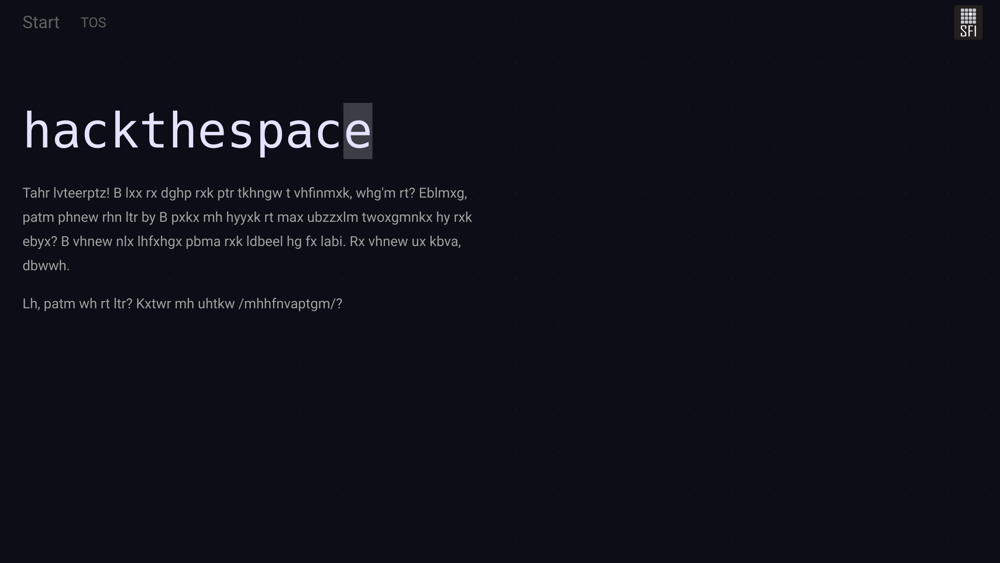

# hackthespace

Hack the Space is a cyber security CTF-like game created for the [15th SFI
Academic IT Festival](https://sfi.pl/). The game consists of 12 puzzles
in the field of cryptanalysis, steganography, reverse engineering, and
web application security.




## Dependencies

* Python 3.5+ (dev package)
* GCC, G++
* ffmpeg
* taglib (dev package)

### Debian
```
sudo apt install python3 python3-dev gcc g++ ffmpeg libtag1-dev
```

### Arch Linux
```
sudo pacman -S python gcc ffmpeg taglib
```


## Quick Start

It is recommended to use `virtualenv`.

```
pip install -r requirements.txt
cp hackthespace/settings/local_settings.py{.example,}
python manage.py migrate
python manage.py generate_assets
python manage.py runserver
```


## Deployment

Use `production_settings.py.example` as the settings base. Remember to
compile the SCSSes before collecting the static files:

```
python manage.py compilescss
python manage.py collectstatic
```

Then, use standard methods of deploying Django apps, e.g. using uwsgi
and nginx.


## Write-up

There is a short description of the puzzles available in
[the docs/ directory](docs/README.md).


## Attribution

### First party

Other people taking part in the development of the game, but not present
as the authors of the commits:

* Storyline
  * [@mdymek](https://github.com/mdymek)
* Graphics
  * Maksymilian Szymczak
  * Patrycja Kochan
* Name, Terms of Service
  * Jan Kubierecki
* Testing, ideas
  * [@apardyl](https://github.com/apardyl/)
  * Marta Kondratowicz
  * Mateusz Hordyński
  * [@pitpo](https://github.com/pitpo)


### Third party

The repository contains files of the following third-party projects:

* [Bootstrap](https://github.com/twbs/bootstrap) licensed under the MIT license
* [Neon Glow Theme](https://hackerthemes.com/bootstrap-themes/neon-glow/)
    licensed under the MIT license 
* [jQuery Terminal Emulator](https://github.com/jcubic/jquery.terminal)
    licensed under the MIT license
* [Open Iconic](https://useiconic.com/open) licensed under the MIT license,
    fonts licensed under the Open Font License
