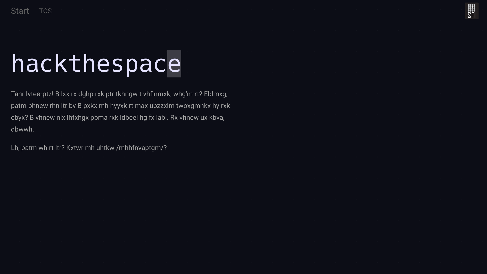

# hackthespace

Hack the Space is a cyber security CTF-like game created for the [15th SFI
Academic IT Festival](https://sfi.pl/). The game consists of 12 puzzles
in the field of cryptanalysis, steganography, reverse engineering, and
web application security.




The game is built in [Rust](https://www.rust-lang.org/) with the
[Cot](https://cot.rs/) web framework.


## Dependencies

* A [Rust](https://www.rust-lang.org/) toolchain (edition 2024, Rust 1.94 or
  newer)
* A C compiler (needed to build the bundled SQLite)

### Debian
```
sudo apt install build-essential
```

### Arch Linux
```
sudo pacman -S base-devel
```

The Bootstrap sources live in a git submodule, so clone the repository
recursively (or run `git submodule update --init` in an existing clone):

```
git clone --recursive git@github.com:m4tx/hackthespace.git
```


## Quick Start

Static assets (CSS and generated images) are produced by `build.rs`, and the
HTML templates are compiled into the binary, so a single command builds and
serves everything:

```
cargo run
```

The development server starts at <http://127.0.0.1:8000> using the
`config/dev.toml` configuration. The SQLite database is created and migrated
automatically on the first run.


## Deployment

The recommended way to deploy is via the prebuilt container image published to
the GitHub Container Registry on every push:

```
docker compose up -d
```

`compose.yml` pulls `ghcr.io/m4tx/hackthespace:master`. To build the image
locally instead, use `compose.dev.yml`:

```
docker compose -f compose.dev.yml up -d --build
```

The container listens on port 8000. Both compose files mount the local
`config/` directory into the container (read-only), so the configuration stays
editable from the host; by default the server uses `config/dev.toml`. For a
custom deployment, copy `config/prod.toml.example` to `config/prod.toml`, set a
random hex `secret_key`, and start the server with `-c prod` (e.g. by overriding
the container `command`).

To run without Docker, build the release binary and run it from a directory
containing the `config/` folder:

```
cargo build --release
./target/release/hackthespace -c prod -l 0.0.0.0:8000
```


## Write-up

There is a short description of the puzzles available in
[the docs/ directory](docs/README.md).


## Attribution

### First party

Other people taking part in the development of the game, but not present
as the authors of the commits:

* Storyline
  * [@mdymek](https://github.com/mdymek)
* Graphics
  * Maksymilian Szymczak
  * Patrycja Kochan
* Name, Terms of Service
  * Jan Kubierecki
* Testing, ideas
  * [@apardyl](https://github.com/apardyl/)
  * Marta Kondratowicz
  * Mateusz Hordyński
  * [@pitpo](https://github.com/pitpo)


### Third party

The repository contains files of the following third-party projects:

* [Bootstrap](https://github.com/twbs/bootstrap) licensed under the MIT license
* [Neon Glow Theme](https://hackerthemes.com/bootstrap-themes/neon-glow/)
    licensed under the MIT license 
* [jQuery Terminal Emulator](https://github.com/jcubic/jquery.terminal)
    licensed under the MIT license
* [Open Iconic](https://useiconic.com/open) licensed under the MIT license,
    fonts licensed under the Open Font License
