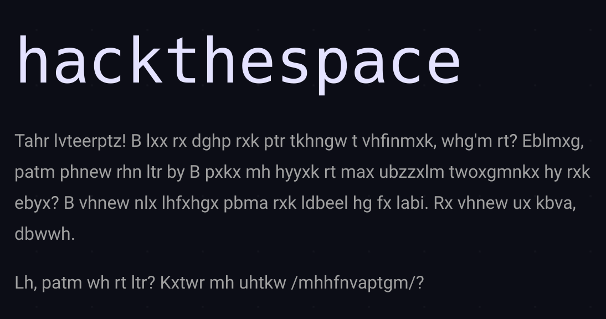

# rot13: `/`

There is a text looking like a random gibberish on the homepage.

The text is encrypted using ROT19. ROT7 should be therefore used to get
the original message.

> Ahoy scallywag! I see ye know yer way around a computer, don't ya? Listen, 
  what would you say if I were to offer ya the biggest adventure of yer life?
  I could use someone with yer skills on me ship. Ye could be rich, kiddo.
>
> So, what do ya say? Ready to board /toomuchwant/?
