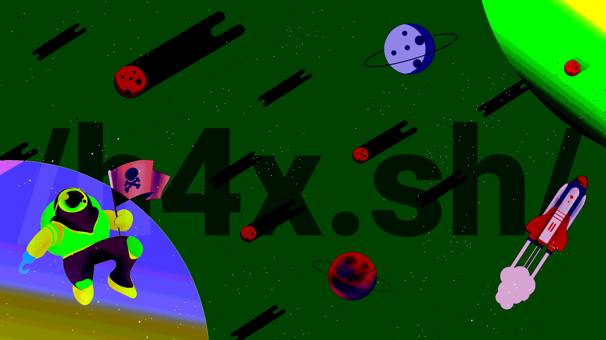

# image: `lookclosely/`

The puzzle consists of a fullscreen image.

Modifying the color curves and increasing contrast in a graphics editor revels
that there is large, almost transparent text with a URL pointing to the next
puzzle.

