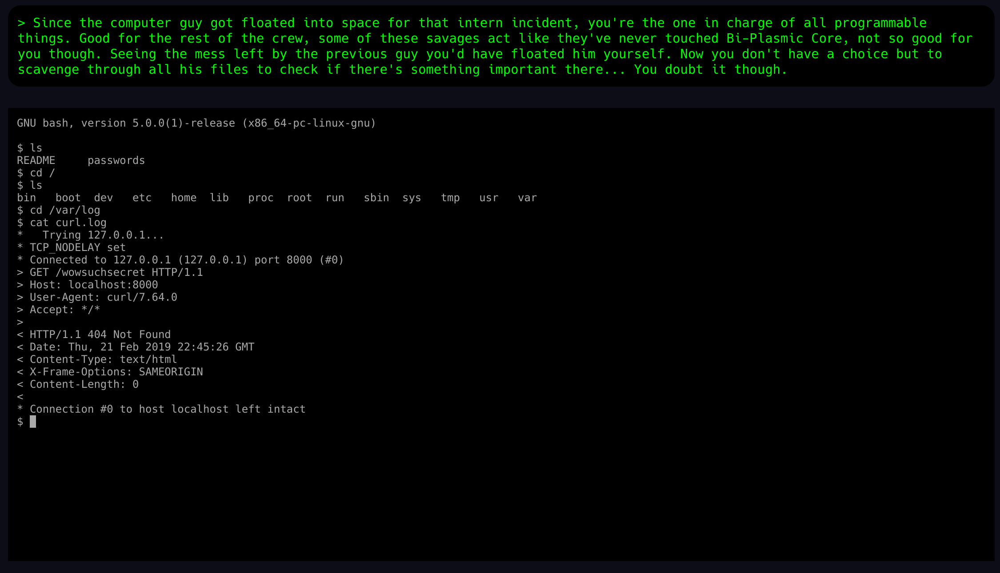

# terminal: `h4x.sh/`

The puzzle tests the knowledge of basic Linux commands. The goal is to 
traverse the root filesystem and find `/var/log/curl.log` file that contains
the URL to the next puzzle.

## Secret

There is a secret hidden in the puzzle: `/bin` directory contains a file
called `f1ndpr1ze.sh`. Visiting `/f1ndpr1ze.sh/` reveals the secret.
