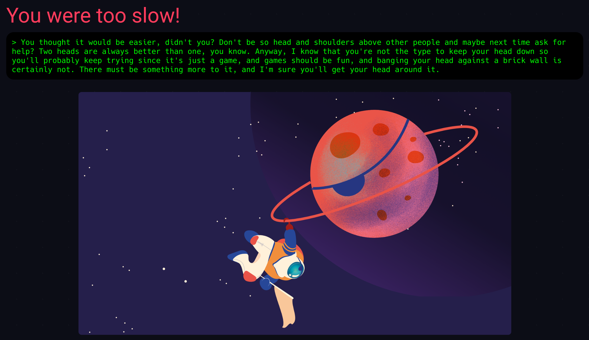
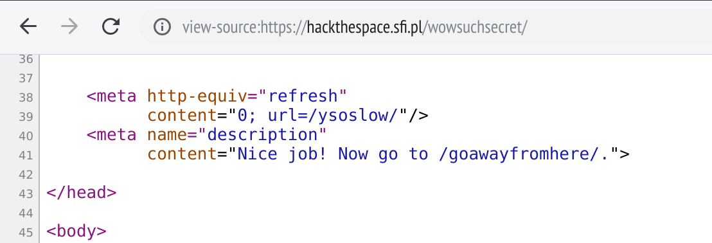

# redirect: `wowsuchsecret/`

The page tells the player that they were too slow:

While the message may look like someone outperformed the player in the contest,
it actually refers to something else. The page this message is displayed on
actually has different a URL than the original, found in the previous puzzle:
`/ysoslow/`. The original URL, `/wowsuchecret/` immediately redirects to
the former — thus, "You were too slow" refers to the fact the player have not
stopped loading the page fast enough to intercept the redirect. Another hint
is hidden in the description: there are lots of idioms containing word
"head" — the goal is to look into the `<head>` section of the original URL.

Solving the puzzle can be therefore done by looking at the source of the
original page. In Chrome, for example, this is possible by putting
`view-source:` in front of the address.

