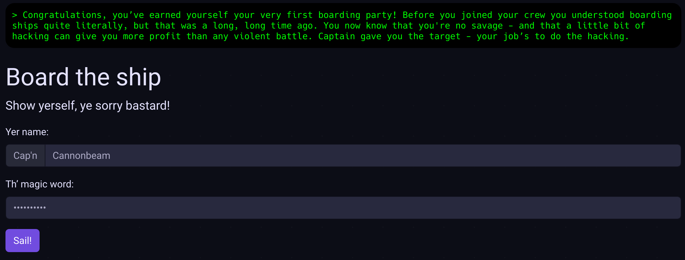

# login: `goawayfromhere/`

The page contains a pretty standard looking login form with username and
password fields. The solution is hidden in the page source: there is a fake
PHP notice comment line just above the form:

```html
<!-- Notice: Debug: MD5(pw('Cannonbeam')) = '074d2d51fe389256f3800e32b0e3c069'; in /home/hackthespace/public_html/inc/login.php on line 237 -->
``` 

By using some MD5 decrypting tool (based on a hash database), one could
find the password which is `starjammer`.


