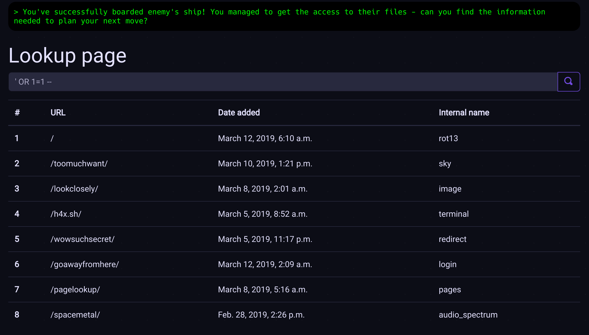

# pages: `pagelookup/`

The page allows the player to retrieve some basic information about the puzzles
they managed to finish given a URL.


The goal is to use SQL injection to retrieve data about the next puzzle.
The query used for the form look like so:

```sql
SELECT * FROM pages_puzzle WHERE url = '{query}';
```

A valid query text that can be used may therefore be, for example,
`' OR 1=1; --`. This gives a query like so:

```sql
SELECT * FROM pages_puzzle WHERE url = '' OR 1=1; --';
```

The query gives the following result:


