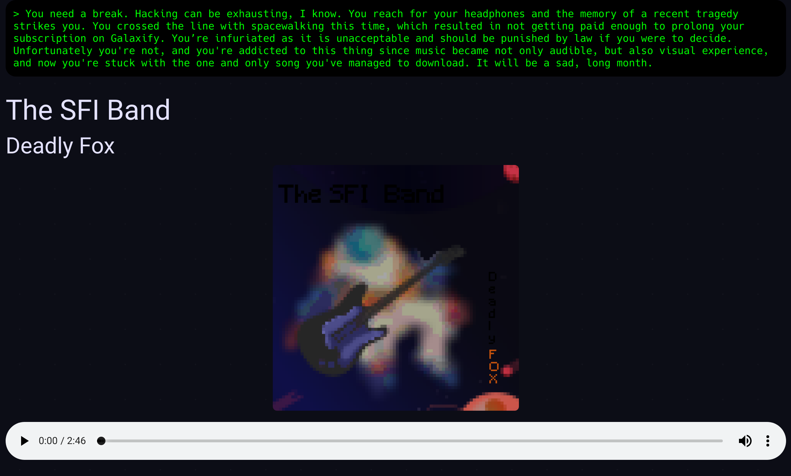
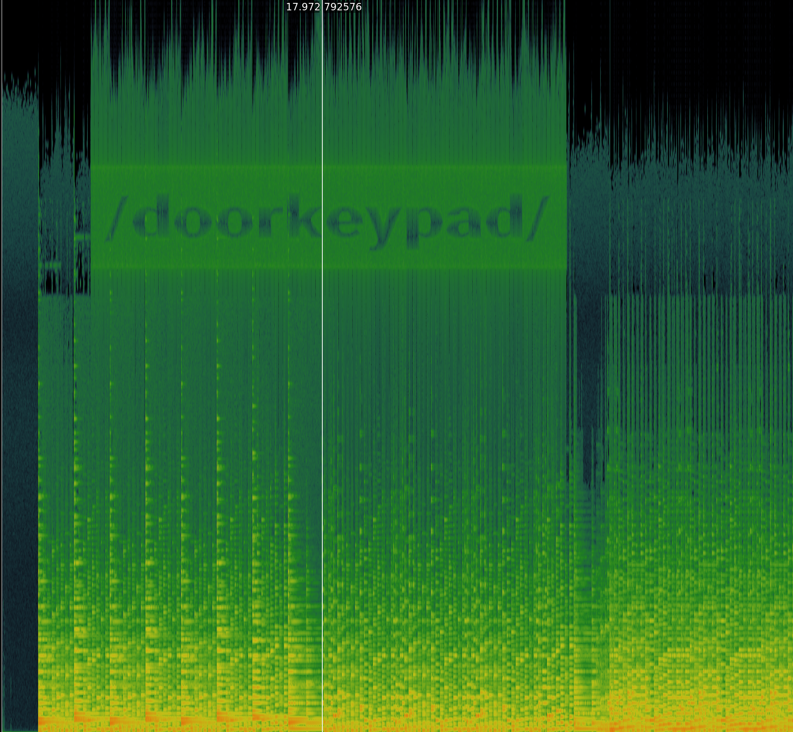

# audio_spectrum: `spacemetal/`

The page contains an audio player with over 2-minute long song called
Deadly Fox.



The metadata written to the file try to troll the player — the comment field
contains mysteriously looking hexadecimal digits:

```
$ exiftool deadlyfox.ogg 
ExifTool Version Number         : 11.30
File Name                       : deadlyfox.ogg
Directory                       : .
File Size                       : 5.1 MB
...
Vendor                          : Lavf57.56.101
Album                           : Surfing in Space
Artist                          : SFI
Comment                         : 000000A5 000000CC 000096C2 00000022 0000C9EE 0000006A
Date                            : 2019
Encoder                         : Lavc57.64.101 libvorbis
Title                           : Deadly Fox
Track Number                    : 9/11
Duration                        : 0:02:47 (approx)
```  

The digits are totally random though. The actual goal is to download the
audio file and look at its spectrogram in a software like Audacity or
Sonic Visualiser. This reveals a URL to the next puzzle.


