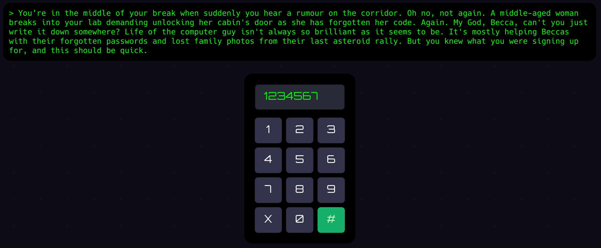

# keypad: `doorkeypad/`

The page contains a 12-key keypad:



The green submit button causes the display to show "ERR" message if the key
entered is invalid. The keypad is not making any HTTP requests though — this
suggests that the checking is done at the client side. 

The goal is to look at the JavaScript files used by the page and discover
there is one called `keypad.js` with a function `checkCodeValid(code)` defined
like so:

```js
function checkCodeValid(code) {
    if (code.length !== 7) {
        return false;
    }

    if (!/^(?:\b(4(2)){1,3}[^2346789]*?\1\d\2\b|(?![135])16{1,2}\x33\068)$/.test(code)) {
        return false;
    }

    let sum = 0;
    for (let key of code) {
        sum += key.charCodeAt(0) - '0'.charCodeAt(0);
    }
    return sum === 28;
}
``` 

There are some key observations that come from the code:

* The key must be 7 digits long
* It must match the regex in the second `if` statement. A short analysis:
  * The second part of the OR (`(?![135])16{1,2}\x33\068)`) does not ever
    match anything
  * The word boundaries (`\b`) are there just to obfuscate the expression
    (as `^` and `$` already have the same effect). The regex can be simplified
    to `(4(2)){1,3}[^2346789]*?\1\d\2`
  * The first group is always `42`, the second group is always `2`. The regex
    can be therefore simplified to `(42){1,3}[^2346789]*?42\d2`
  * `[^2346789]` may be written simpler as `[015]`. This gives
    `(42){1,3}[015]*?42\d2`.
  * One cannot obtain a 7-digit code if `42` at the beginning is there more
    than once, or if `[015]` does not appear exactly once. We obtain
    `42[015]42\d2`. This is as simple as we can get without any further
    information.
* Finally, the code checks if the sum of the digits is equal to 28. The sum
  of the digits we are have is 4+2+4+2+2=14. We still have 2 digits left, one
  of which is 0, 1, or 5. We cannot obtain sum equal to 28 when we use 0 or 1
  for the first one, so 5 is the only digit left, and 9 replaces `\d` in
  the regex.

The code is therefore `4254292`. It is double checked on the server side and
if it is valid, the player is redirected to the next puzzle.
