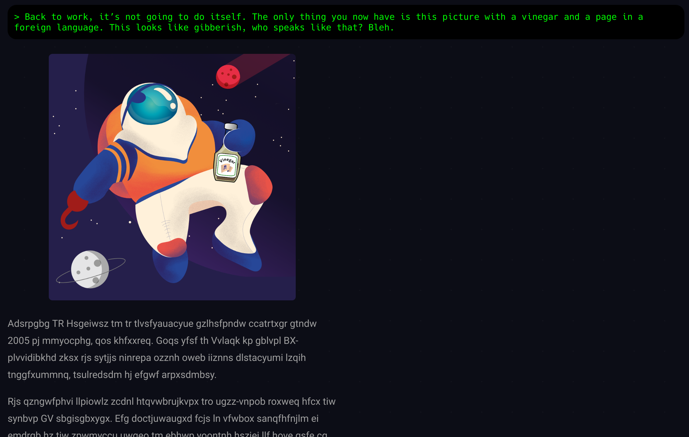

# vigenere: `dramaticvinegar/`

The page contains a weird-looking long text and a picture with a space pirate
holding a bottle with vinegar in their left hand.

The vinegar is obviously a hint — googling `vinegar cipher` auto-corrects the
search query to `vigenere cipher`, which is what was used to encrypt the text.
There are several ways to decrypt it:

* One could guess that the text is just taken from the
  [SFI "About us" page](https://sfi.pl/en/about-sfi/), and go letter-by-letter
  to obtain the key used to encrypt the text,
* Standard Vigenère cipher breaking methods, like Kasiski's test and frequency
  analysis also give good results.
  
The key used is `ABSOLUTELYCOOL`.

> Academic IT Festival is an international conference organized since 2005
> by students, for students. Each year in Cracow we gather IT-enthusiasts from
> the entire country along with people passionate about informatics, regardless
> of their profession.
>
> The conference annually hosts distinguished and well-known guests from
> the entire IT environment. The participants have an unique opportunity to
> listen to the lectures given by those amazing people and take part
> in workshops to develop their practical skills. Diversity of the topics
> allows everybody to find something interesting. It is rare opportunity
> to meet lots of experts face to face in one place and learn from them.
>
> The festival gives you a chance to share your knowledge, views, opinions
> and more, with people with similar interests. It lets you become more aware
> of the IT world, make new connections, meet interesting people, expand
> horizons.
>
> And the best part is – it does not cost you a thing!
>
> Financially speaking, it is absolutely free. **The next puzzle is
> /lookcloser/**. The only ticket you will ever need is passion and interest.
>
> Three days, over a dozen of lectures and lot of speakers. All that for
> thousands of satisfied participants and uncountable amount of gained skills,
> positive impressions and emotions. That is what SFI is all about. This
> conference is one of a kind, organized year after year by students,
> for students.
