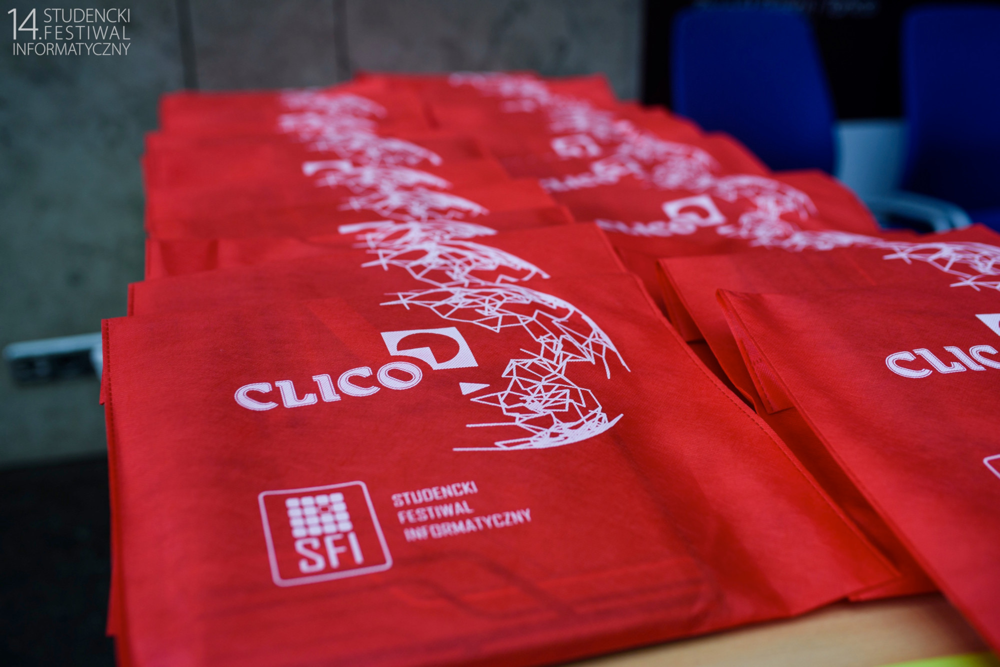

# stego_mix: `lookcloser/`

The first impression is pretty much the same as in the `image` puzzle.
Again, the player is given a full-screen image. However, this time, fiddling
with color curves does not do any good.



The data is hidden another way. Downloading the image and using `binwalk`
or `strings` reveals what it is:

```
$ binwalk lookcloser.jpg 

DECIMAL       HEXADECIMAL     DESCRIPTION
--------------------------------------------------------------------------------
0             0x0             JPEG image data, JFIF standard 1.01
424097        0x678A1         Zip archive data, at least v2.0 to extract, compressed size: 586755, uncompressed size: 587036, name: /look.png
1010891       0xF6CCB         Zip archive data, at least v2.0 to extract, compressed size: 914801, uncompressed size: 920332, name: /at.jpg
1925729       0x1D6261        Zip archive data, at least v2.0 to extract, compressed size: 155, uncompressed size: 200, name: /me.zip
1926082       0x1D63C2        End of Zip archive
```

The JPEG file is actually also a valid ZIP file. Extracting it reveals three
other files: `look.png`, `at.jpg` and `me.zip`.

* `look.png`
  
  The image contains another image hidden on 3 least significant bits of
  the pixels.
  
  The hidden text contains text `This1sN0t`.
* `at.jpg`
  
  The image contains a base64-encoded text at the end of the file:
  ```
  $ strings at.jpg | tail -n5 
  <t?Z
  P"cr6
  =k.F
  Ys3u^
  NG5PcmQxbkByeUlURmVzdGl2YWw=
  
  $ base64 -d <<<NG5PcmQxbkByeUlURmVzdGl2YWw= 
  4nOrd1n@ryITFestival
  ```
* `me.zip`

  The ZIP file is encrypted with a password being the concatenation of the
  texts hidden in two previous files: `This1sN0t4nOrd1n@ryITFestival`. The ZIP
  archive contains one file inside:
    * `readme.txt`
      ```
      Congratulations on solving the puzzle!

      Visit /ayeayepatch/ to continue.
      ```
